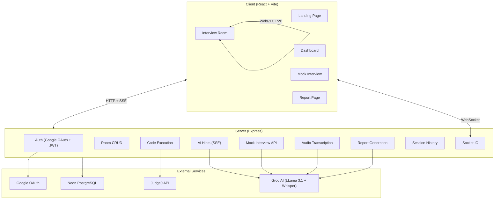
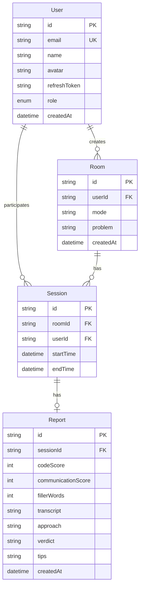

# LiveCode — Full Project Audit & Enhancement Plan

## What Is LiveCode?

A **full-stack live coding interview platform** — not just a code editor, but a complete interview simulation tool with AI-powered evaluation. Think a lightweight mix of **CoderPad + Pramp + LeetCode**.

### Tech Stack

| Layer | Tech |
|---|---|
| Frontend | React 19 + Vite + TypeScript + Tailwind CSS v4 |
| State | Redux Toolkit |
| Editor | Monaco Editor (VS Code's engine) |
| Auth | Google OAuth → Passport.js → JWT (access + refresh tokens) |
| Real-time | Socket.IO (code sync + WebRTC signaling) |
| Video | WebRTC (peer-to-peer with STUN) |
| Backend | Express 5 + TypeScript |
| Database | PostgreSQL (Neon serverless) + Prisma ORM |
| Code Execution | Judge0 API |
| AI | Groq SDK — LLama 3.1 (hints, questions, reports) + Whisper (audio transcription) |

### Architecture

---

## ✅ What's Been Done (Complete Feature Inventory)

### Client — 20 source files

| # | Feature | Details |
|---|---|---|
| 1 | Vite + React 19 + TypeScript scaffold | Modern build tooling with HMR |
| 2 | Redux Toolkit state management | Auth slice with user, token, role |
| 3 | Google OAuth login flow | Redirects to server, handles callback, stores JWT |
| 4 | JWT-based auth with auto-attach | Axios interceptor adds Bearer token to all requests |
| 5 | Route protection | `ProtectedRoute` (requires auth) + `PublicOnlyRoute` (guests only) |
| 6 | Landing page | Hero section with gradient blobs, stats, feature cards, CTA |
| 7 | Dashboard | Create room, join room by ID, view past sessions with status |
| 8 | Role system | Interviewer vs Candidate — different UI per role |
| 9 | Monaco code editor | VS Code engine, dark theme, multi-language support |
| 10 | Real-time code sync | Socket.IO broadcasts code changes to room participants |
| 11 | Language selector | JS, Python, C++, Java — mapped to Judge0 language IDs |
| 12 | WebRTC video calls | Peer-to-peer video/audio with STUN, offer/answer/ICE exchange |
| 13 | Audio recording | Records local + remote audio (mixed via AudioContext) |
| 14 | Code execution | Sends code to Judge0, displays stdout/stderr/compile output |
| 15 | AI hints (SSE streaming) | Interviewer can request hints, streamed in real-time |
| 16 | Problem selection | 8 hardcoded problems (Two Sum, Valid Parentheses, etc.) |
| 17 | Mock interview mode | Solo practice with AI-generated questions by difficulty |
| 18 | End session flow | Stops recording → transcribes → ends session → generates report |
| 19 | AI-generated reports | Code score, communication score, verdict, approach, tips |
| 20 | Report viewer page | Displays score progress bar, verdict badge, analysis, tips |

### Server — 21 source files

| # | Feature | Details |
|---|---|---|
| 1 | Express 5 + TypeScript scaffold | ESM modules, strict TypeScript |
| 2 | Prisma ORM + Neon PostgreSQL | 4 models: User, Room, Session, Report |
| 3 | 5 database migrations | Incremental schema evolution |
| 4 | Google OAuth with Passport.js | Creates/finds user, returns profile data |
| 5 | JWT access + refresh token flow | 15min access, 7-day refresh, httpOnly cookie |
| 6 | Auth middleware (verifyToken) | Bearer token verification, sets req.user |
| 7 | Room CRUD | Create (sets INTERVIEWER role), join (sets CANDIDATE), get, set problem, end |
| 8 | Role-based token refresh | New access token issued on create/join with updated role |
| 9 | Code execution proxy | Forwards to Judge0 API with `wait=true` |
| 10 | AI hint generation | Groq LLama 3.1 with SSE streaming, role-gated (no candidates) |
| 11 | Mock question generation | AI generates structured JSON questions with difficulty |
| 12 | Audio transcription | Groq Whisper via multer file upload |
| 13 | Filler word analysis | Counts "um", "uh", "like", "you know", etc. via regex |
| 14 | Report generation | AI evaluates code → codeScore + communicationScore + verdict + tips |
| 15 | Session history API | Returns user's past sessions with room and report data |
| 16 | Socket.IO real-time events | Code sync, language sync, WebRTC signaling, session lifecycle |
| 17 | Health check endpoint | `GET /api/health` |
| 18 | Global error handler | Express error middleware |
| 19 | CORS configuration | Configured for client dev URL |

### Database Schema

### API Inventory (17 endpoints)

| Method | Endpoint | Auth | Controller |
|---|---|---|---|
| `GET` | `/api/health` | ❌ | Health check |
| `GET` | `/api/auth/google` | ❌ | Start OAuth flow |
| `GET` | `/api/auth/google/callback` | ❌ | OAuth callback |
| `GET` | `/api/auth/refresh` | ❌ | Refresh access token |
| `GET` | `/api/auth/logout` | ❌ | Clear refresh token |
| `POST` | `/api/rooms/create` | ✅ | Create room + set INTERVIEWER |
| `POST` | `/api/rooms/join` | ✅ | Join room + set CANDIDATE |
| `GET` | `/api/rooms/:id` | ✅ | Get room details |
| `POST` | `/api/rooms/problem` | ✅ | Set room problem |
| `POST` | `/api/rooms/end` | ✅ | End session |
| `POST` | `/api/code/execute` | ✅ | Execute code via Judge0 |
| `POST` | `/api/ai/hint` | ✅ | AI hints (SSE, role-gated) |
| `POST` | `/api/mock/question` | ✅ | Generate AI question |
| `POST` | `/api/mock/start` | ✅ | Start mock session |
| `POST` | `/api/transcribe` | ⚠️ **NO** | Transcribe audio |
| `POST` | `/api/reports/generate` | ✅ | Generate AI report |
| `GET` | `/api/reports/:sessionId` | ✅ | Get report |
| `GET` | `/api/sessions/my` | ✅ | User's session history |

---

## 🔴 Bugs & Issues Found (18 total)

### High Severity (6)

| # | Issue | Location | Impact |
|---|---|---|---|
| 1 | **6 separate PrismaClient instances** | passport.ts, auth/mock/report/room/session controllers | Creates 6 DB connection pools instead of 1 — wastes resources, risks connection limits |
| 2 | **Transcribe route has NO auth** | `transcribe.routes.ts` | Anyone can call the transcription API without logging in |
| 3 | **Navbar login URL hardcoded** | `Navbar.tsx:34` → `http://localhost:5000` | Breaks in production; Landing.tsx uses env var but Navbar doesn't |
| 4 | **API base URL hardcoded** | `api.ts:4` → `http://localhost:5000/api` | All API calls fail in production |
| 5 | **Socket URL hardcoded** | `socket.ts:3` → `http://localhost:5000` | Real-time features break in production |
| 6 | **`SERVER_URL` env var missing** | `passport.ts` references it, not in `.env` | OAuth callback URL defaults to localhost |

### Medium Severity (7)

| # | Issue | Location | Impact |
|---|---|---|---|
| 7 | **`req.user` typed as `any`** | All 8 controllers | No type safety, potential runtime errors |
| 8 | **No input validation** | All controllers | Bad input causes crashes or unexpected behavior |
| 9 | **`src/types/` directory is empty** | Client types folder | No shared TypeScript interfaces; `any[]` used for sessions |
| 10 | **User name/email always empty** | `authSlice.ts:24` — JWT only has userId + role | User profile incomplete in Redux state |
| 11 | **Dashboard button unstyled** | `Navbar.tsx:26` → `className="..."` (literal string) | Dashboard nav button has no styles |
| 12 | **No 404 route** | `AppRoutes.tsx` | Unknown routes show blank page |
| 13 | **No error boundaries** | Client-wide | Unhandled errors crash the entire app |

### Low Severity (5)

| # | Issue | Location | Impact |
|---|---|---|---|
| 14 | **`recharts` installed but unused** | `package.json` | Bloats bundle size |
| 15 | **`index.html` title is "client"** | `index.html:7` | Bad SEO and browser tab label |
| 16 | **Leftover dev comments** | `authSlice.ts`, `schema.prisma` → `// add this` | Unprofessional in code review |
| 17 | **Duplicated utility code** | `langMap`, `getSupportedMimeType`, `formatTime` in Room.tsx + Mock.tsx | Code duplication |
| 18 | **Redundant auth check** | `Landing.tsx:10-12` — already inside PublicOnlyRoute | Unnecessary code |

---

## 🚀 What To Add — CV-Worthy Enhancements

### 🔥 Phase 1 — Fix What's Broken (Critical)

> [!CAUTION]
> These issues would be caught in any code review and hurt your credibility. Fix them first.

#### 1. Fix PrismaClient Singleton
- Create a shared `prisma.ts` utility that exports ONE PrismaClient instance
- Replace all 6 individual instances across controllers and passport.ts
- **Why**: Shows you understand connection pooling and resource management

#### 2. Fix All Hardcoded URLs
- Move all URLs to environment variables (`VITE_API_URL`, `VITE_SOCKET_URL`)
- Add `SERVER_URL` to `.env`
- Create `.env.example` files for both client and server
- **Why**: Shows production-readiness awareness

#### 3. Add Missing Auth to Transcribe Route
- Apply `verifyToken` middleware to `transcribe.routes.ts`
- **Why**: Security hole — anyone can use your Groq API quota

#### 4. Fix Client-Side Bugs
- Fix Navbar dashboard button styling (`className="..."`)
- Fix page title in `index.html`
- Add 404 catch-all route
- Clean up leftover `// add this` comments
- Remove unused `recharts` dependency
- Extract duplicated `langMap`, `formatTime`, `getSupportedMimeType` into shared utils

#### 5. Add TypeScript Types
- Define proper interfaces in `src/types/`: `User`, `Room`, `Session`, `Report`, `ApiResponse`
- Replace all `any` usages in client and server
- Type `req.user` on the server with a proper interface

---

### 🌟 Phase 2 — Impressive Features (CV Differentiators)

These are what make interviewers say *"this person built something real"*.

#### 6. Live Cursors & Presence Indicators
- Show other user's cursor position in Monaco Editor (different color)
- Display connected users' avatars + names in room header
- Show "User is typing..." indicator
- **Why it stands out**: This is the #1 feature that separates a toy from a real collaboration tool. It's what makes Google Docs feel magical.

#### 7. Use `recharts` for Report Visualization
- You already have it installed — USE IT!
- Radar chart for skills breakdown (code quality, approach, communication)
- Score comparison donut charts
- Session timeline chart in dashboard (sessions over time)
- **Why it stands out**: Visual data presentation shows frontend depth

#### 8. Room Chat / Discussion Panel
- Real-time chat sidebar in the interview room via Socket.IO
- Message history during the session
- Timestamps + user avatars
- **Why it stands out**: Real interview platforms always have communication beyond video

#### 9. Custom Problem Bank (CRUD)
- Replace the 8 hardcoded problems with a database-backed problem bank
- Let interviewers create/edit/save custom problems with test cases
- Difficulty tags, categories (arrays, strings, trees, etc.)
- **Why it stands out**: Shows full CRUD beyond the basic models, adds real-world value

#### 10. STDIN Support
- Add an input panel for programs that need user input
- Pass stdin to Judge0 API
- **Why it stands out**: Without this, you can't run interactive programs — limits usefulness

---

### 💎 Phase 3 — Polish & Production Quality

#### 11. UI/UX Overhaul
- Resizable split panes for editor/output (use `react-resizable-panels`)
- Loading skeletons during API calls
- Smooth page transitions
- Toast notifications for all user actions (already have `react-hot-toast`)
- Responsive design or "desktop only" notice
- **Why**: First impressions matter — a polished UI shows attention to detail

#### 12. Input Validation (Zod)
- Add `zod` schema validation on all server endpoints
- Return structured error responses
- Client-side form validation
- **Why**: Shows you care about data integrity and security

#### 13. Rate Limiting & Security
- Rate limit `/api/code/execute` and `/api/ai/hint` (expensive external APIs)
- Add Helmet.js for security headers
- Sanitize user inputs
- **Why**: Shows security awareness

---

### 🚀 Phase 4 — Production & Documentation

#### 14. Deployment
- Dockerize both client and server (`Dockerfile` + `docker-compose.yml`)
- Deploy: Vercel (client) + Railway/Render (server)
- Add GitHub Actions CI: lint + type-check on push
- **Why**: A deployed, live demo is 10x more impressive than "run it locally"

#### 15. README & Documentation
- Professional README with:
  - Screenshots / demo GIF
  - Architecture diagram (use the mermaid diagram above)
  - Feature list
  - Setup instructions
  - Tech stack badges
- API documentation table
- **Why**: The first thing anyone sees on GitHub. This IS your CV presentation.

---

## Suggested Implementation Order

| Phase | Features | Effort |
|---|---|---|
| **Phase 1** — Fix Bugs | #1-5 (PrismaClient, URLs, auth, types, client bugs) | **1 day** |
| **Phase 2** — Wow Features | Pick 2-3 from #6-10 | **3-4 days** |
| **Phase 3** — Polish | #11-13 (UI, validation, security) | **2-3 days** |
| **Phase 4** — Ship It | #14-15 (Deploy, README) | **1-2 days** |

---

## Open Questions

> [!IMPORTANT]
> **Which Phase 2 features excite you most?** I'd recommend **#6 (Live Cursors)** and **#7 (Recharts Reports)** as the highest impact-to-effort ratio. Live cursors are a "wow" feature, and you already have recharts installed.

> [!IMPORTANT]
> **Do you want to start with Phase 1 bug fixes?** These are quick wins that immediately make the codebase more professional. I can start fixing them right away.

> [!NOTE]
> **Deployment preferences?** Vercel + Railway is the easiest free stack. Docker is more impressive but requires a paid host. Do you have any accounts set up?

> [!NOTE]
> **Keep Tailwind CSS?** Your project already uses Tailwind v4 extensively. Switching to vanilla CSS would require rewriting all components. I'd recommend keeping Tailwind.
